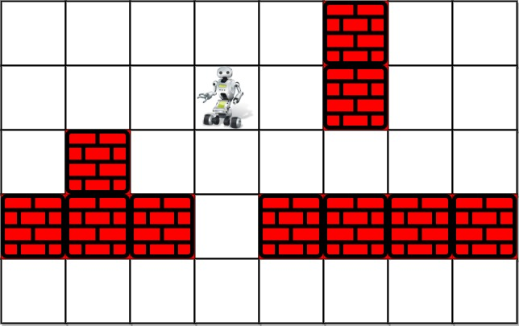

# Robot Room Cleaning
https://leetcode.com/problems/robot-room-cleaner/description/
## Problem Statement

You are controlling a robot that is located somewhere in a room. The room is modeled as an `m x n` binary grid where `0` represents a wall and `1` represents an empty slot.

The robot starts at an unknown location in the room that is guaranteed to be empty. You do not have access to the grid, but you can move the robot using the given API `Robot`.

Your task is to design an algorithm to clean the entire room (i.e., clean every empty cell in the room). The robot can move forward, turn left, or turn right. Each turn is `90` degrees.

When the robot tries to move into a wall cell, its bumper sensor detects the obstacle, and it stays on the current cell.

## API Description

The robot can be controlled using the following APIs:

```java
interface Robot {
  // Returns true if the next cell is open and the robot moves into the cell.
  // Returns false if the next cell is an obstacle and the robot stays on the current cell.
  boolean move();

  // Robot will stay on the same cell after calling turnLeft/turnRight.
  // Each turn will be 90 degrees.
  void turnLeft();
  void turnRight();

  // Clean the current cell.
  void clean();
}
```

**Notes:**
- The initial direction of the robot is facing up.
- The four edges of the grid are all surrounded by walls.

## Custom Testing

- The input is only used to initialize the room and the robot's position internally.
- The problem must be solved "blindfolded", meaning the robot can only be controlled using the provided APIs without knowing the room layout or its initial position.

## Examples

### Example 1



**Input:**
```plaintext
room = [[1,1,1,1,1,0,1,1],
        [1,1,1,1,1,0,1,1],
        [1,0,1,1,1,1,1,1],
        [0,0,0,1,0,0,0,0],
        [1,1,1,1,1,1,1,1]],
row = 1, col = 3
```

**Output:**
```plaintext
Robot cleaned all rooms.
```

**Explanation:**
- All grids in the room are marked by either `0` or `1`.
- `0` means the cell is blocked, while `1` means the cell is accessible.
- The robot initially starts at position `(row=1, col=3)`.

### Example 2

**Input:**
```plaintext
room = [[1]], row = 0, col = 0
```

**Output:**
```plaintext
Robot cleaned all rooms.
```

## Constraints

- `m == room.length`
- `n == room[i].length`
- `1 <= m <= 100`
- `1 <= n <= 200`
- `room[i][j]` is either `0` or `1`.
- `0 <= row < m`
- `0 <= col < n`
- `room[row][col] == 1`
- All the empty cells can be visited from the starting position.

